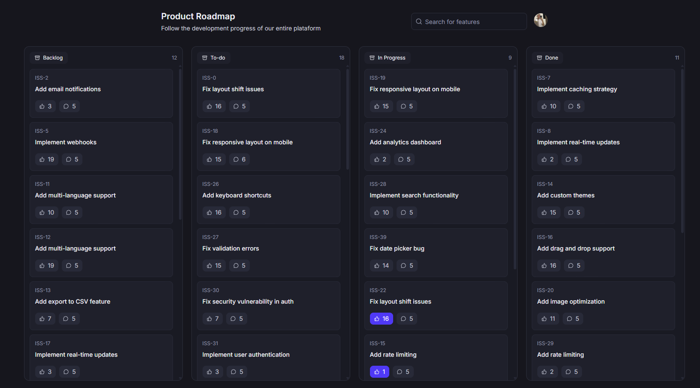
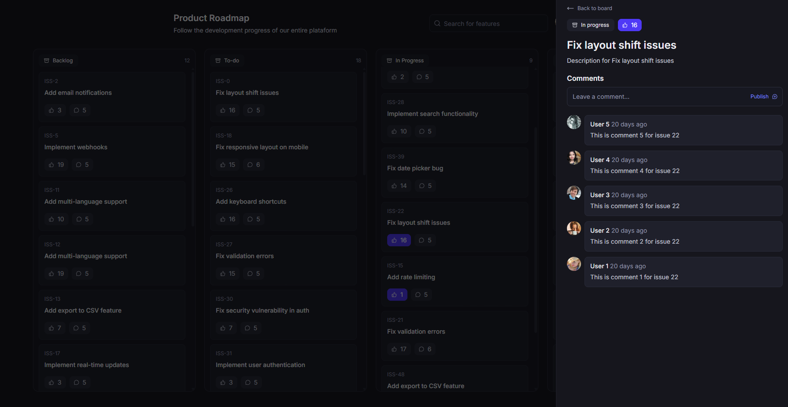
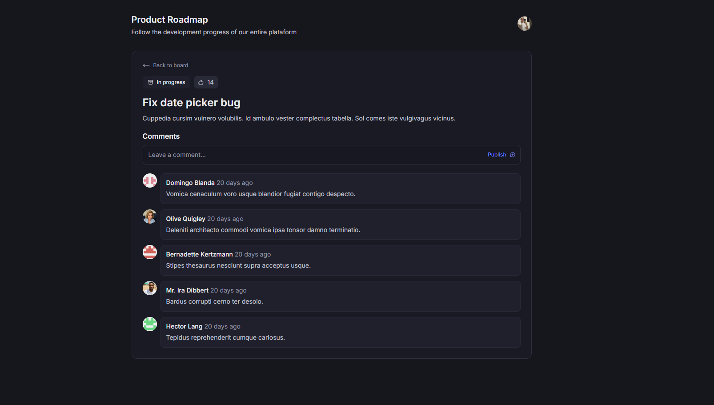

<p align="right">
  <a href="./README.md">🇺🇸 English</a> | <b>🇧🇷 Português</b>
</p>

# 🗺️ Board — Roadmap Público

> Projeto de estudo construído para aprofundar conhecimentos em **Next.js**, explorando seus recursos mais modernos (App Router, React Server Components, Partial Pre-Rendering, Parallel/Intercepting Routes) junto a uma stack moderna do ecossistema React/TypeScript.


---

## 📖 Sobre o projeto

**Board** é uma aplicação completa de **roadmap público**, onde usuários autenticados podem visualizar, curtir e comentar em itens de roadmap organizados por status (ex: Backlog, To-do, In Progress, Done).

O projeto explora os recursos mais modernos do **Next.js** com a App Router: autenticação social, Server e Client Components trabalhando em conjunto, Partial Pre-Rendering combinado com Suspense, interações otimistas via React Query (likes e comentários), Parallel Routes, Intercepting Routes para modais e geração automática de imagens Open Graph.

> ⚠️ Este é um **projeto de estudo (sem fins comerciais)**, construído com o objetivo de praticar e aprender, na prática, recursos modernos do **Next.js** e seu ecossistema (Server Actions, Drizzle ORM, Hono, better-auth, React Query, entre outros).

---

## 🖼️ Screenshots

**Board do roadmap** — itens organizados em colunas por status (Backlog, To-do, In Progress, Done), cada um com contadores de likes e comentários.



**Detalhe do item via Intercepting Route** — ao clicar em um card, os detalhes abrem em um modal sobre o board, preservando o contexto de navegação, com likes otimistas e uma thread de comentários.



**Detalhe do item como página dedicada** — ao navegar diretamente para um item (por exemplo, via link compartilhado), a página completa é renderizada em vez do modal.



---

## ✨ Funcionalidades

- 🔐 **Autenticação social** via [better-auth](https://www.better-auth.com/)
- 🗂️ **Roadmap público** com itens organizados por status/coluna
- 👍 **Likes** em itens do roadmap com **interface otimista** (React Query)
- 💬 **Comentários** com atualização otimista da UI
- 🪟 **Modais via Intercepting Routes** para detalhes de itens sem perder o contexto da navegação
- 🧩 **Parallel Routes** para composição de layouts independentes na mesma tela
- ⚡ **Partial Pre-Rendering (PPR)** combinado com **Suspense** para conteúdo estático e dinâmico na mesma página
- 🖼️ **Geração automática de imagens Open Graph** para compartilhamento
- 🔎 **Estado sincronizado na URL** (filtros, buscas) com nuqs
- 📄 **Documentação de API interativa** com Scalar (baseada em OpenAPI)
- 🌱 **Seed de dados fake** para desenvolvimento local

---

## 🛠️ Tech stack

### Core

- **[Next.js 16](https://nextjs.org/)** — framework React com App Router
- **[React 19](https://react.dev/)** — biblioteca de UI
- **[TypeScript](https://www.typescriptlang.org/)** — tipagem estática
- **[React Compiler](https://react.dev/learn/react-compiler)** — otimizações automáticas de renderização

### API / Backend

- **[Hono](https://hono.dev/)** — framework web leve para as rotas de API
- **[@hono/zod-openapi](https://github.com/honojs/middleware/tree/main/packages/zod-openapi)** — rotas tipadas com validação Zod e especificação OpenAPI
- **[@scalar/hono-api-reference](https://github.com/scalar/scalar)** — documentação interativa da API
- **[better-auth](https://www.better-auth.com/)** — autenticação (incluindo login social)

### Banco de dados

- **[Drizzle ORM](https://orm.drizzle.team/)** — ORM TypeScript-first
- **[drizzle-kit](https://orm.drizzle.team/kit-docs/overview)** — migrações e schema
- **[postgres](https://github.com/porsager/postgres)** — driver PostgreSQL
- **[@faker-js/faker](https://fakerjs.dev/)** — geração de dados fake para seed

### Dados e estado

- **[TanStack Query (React Query)](https://tanstack.com/query)** — cache e sincronização de dados, com updates otimistas
- **[nuqs](https://nuqs.47ng.com/)** — estado sincronizado com a URL

### UI / Estilização

- **[Tailwind CSS 4](https://tailwindcss.com/)** — estilização utility-first
- **[Radix UI](https://www.radix-ui.com/)** — componentes acessíveis e não estilizados (Dialog)
- **[lucide-react](https://lucide.dev/)** — ícones
- **[tailwind-merge](https://github.com/dcastil/tailwind-merge)** — composição de classes CSS
- **[tailwind-scrollbar](https://www.npmjs.com/package/tailwind-scrollbar)** — estilização de scrollbars

### Formulários e validação

- **[React Hook Form](https://react-hook-form.com/)** — gerenciamento de estado de formulários
- **[Zod](https://zod.dev/)** — validação de schemas
- **[@hookform/resolvers](https://github.com/react-hook-form/resolvers)** — integração RHF + Zod

### Utilitários

- **[date-fns](https://date-fns.org/)** — manipulação de datas
- **[server-only](https://www.npmjs.com/package/server-only)** — garante que módulos sensíveis rodem apenas no servidor

### Qualidade de código

- **ESLint** + **eslint-config-next** — lint do código
- **tsx** — execução de scripts TypeScript (ex: seed do banco)

---

## 🚀 Como rodar o projeto

### Pré-requisitos

- [Node.js](https://nodejs.org/) 20+
- [PostgreSQL](https://www.postgresql.org/) instalado e em execução
- Seu gerenciador de pacotes de preferência (`npm`, `yarn` ou `pnpm`)

### Passo a passo

```bash
# 1. Clone o repositório
git clone https://github.com/seu-usuario/board.git
cd board

# 2. Instale as dependências
npm install

# 3. Configure as variáveis de ambiente
cp .env.example .env
# edite o .env com sua string de conexão do PostgreSQL e as credenciais de auth social

# 4. Gere e aplique as migrações do banco
npm run db:generate
npm run db:migrate

# 5. (Opcional) Popule o banco com dados fake
npm run db:seed

# 6. Inicie o servidor de desenvolvimento
npm run dev
```

A aplicação estará disponível em [http://localhost:3000](http://localhost:3000).

### Scripts disponíveis

| Script                | Descrição                                                  |
| --------------------- | ---------------------------------------------------------- |
| `npm run dev`         | Inicia o servidor de desenvolvimento                       |
| `npm run build`       | Gera o build de produção                                   |
| `npm run start`       | Inicia o servidor em modo produção                         |
| `npm run lint`        | Executa o ESLint                                           |
| `npm run db:generate` | Gera as migrações a partir do schema Drizzle               |
| `npm run db:migrate`  | Aplica as migrações pendentes no banco                     |
| `npm run db:push`     | Sincroniza o schema diretamente com o banco (sem migração) |
| `npm run db:studio`   | Abre o Drizzle Studio para visualizar/editar o banco       |
| `npm run db:seed`     | Popula o banco com dados fake (via faker)                  |

---

## 🎯 Objetivos de aprendizado

Este projeto foi construído para consolidar, na prática, conceitos como:

- Estrutura e convenções da **App Router** do Next.js
- **Autenticação social** com better-auth
- **Server e Client Components** trabalhando em conjunto
- **Partial Pre-Rendering (PPR)** e **Suspense API** para páginas híbridas (estático + dinâmico)
- **React Query** para interações com UI otimista (likes e comentários)
- **Parallel Routes** para composição de múltiplas seções independentes
- **Intercepting Routes** para modais que preservam o contexto de navegação
- **Geração automática de imagens Open Graph**
- Construção de uma API tipada com **Hono** + **Zod** + documentação **OpenAPI**
- Modelagem e migrações de banco de dados com **Drizzle ORM**
- Uso do **React Compiler** para otimizações automáticas

---

## 📄 Licença

Este projeto está licenciado sob [MIT](LICENSE) e tem finalidade exclusivamente educacional.

---

<p align="center">Construído para fins de aprendizado</p>
